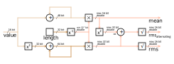

# lib-c-rms

The RMS calculation is object-oriented and designed to be called with each new measured value. The functions `rms16.AddUnsigned()` or `rms16.AddSigned()` can be used for this purpose. As soon as all values are available, the calculation of the values `mean`, `rms_alternating` and `rms` starts. Then the handler stored in the function pointer `on_calculated` is called. After the handler has been called in the add function, this function is exited with the return value `true`.

<picture>
  <source
    media="(prefers-color-scheme: dark)"
    srcset="./docs/signal_flow_dark.svg" />
  
</picture>

## Example

The code can be used as follows:

```c
double rms, rms_alternating, mean;

rms16_t rms_object = RMS16_INIT(
    2,  // LENGTH
    0.5 // LENGTH_RECIPROCAL
);

uint16_t input_data[] = { 2, 1 };

for(uint8_t i = 0; i < rms_object.length; i++)
{
    if(rms16.AddUnsigned(&rms_object, input_data[i]))
    {
        rms = rms_object.rms; // 1.5811388...
        rms_alternating = rms_object.rms_alternating; // 0.5
        mean = rms_object.mean; // 1.5
    }
}

// Suppresses the warning, variable is not used
if(0 == rms || 0 == rms_alternating || 0 == mean){ ; }
```
