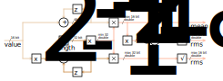

# lib-c-rms

The RMS calculation is object-oriented and designed to be called with each new
measured value. The functions `rms16u_add()` or `rms16i_add()` can be called
for this purpose. If all values are available, the handler stored in the
function pointer `calculated` is called. After the handler has been called in
the add function, this function is exited with the return value `true`.

 

The code can be used as follows:

```c
double rms, rms_alternating, mean;

rms16_t rms_object = RMS16_INIT(
    2,  // LENGTH
    0.5 // LENGTH_RECIPROCAL
);

uint16_t input_data[] = { 2, 1 };

for(uint8_t i = 0; i < rms_object.length; i++)
{
    if(rms16u_add(&rms_object, input_data[i]))
    {
        rms = rms_object.rms; // 1.5811388...
        rms_alternating = rms_object.rms_alternating; // 0.5
        mean = rms_object.mean; // 1.5
    }
}
```
